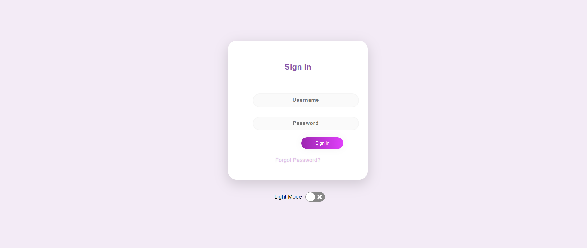

# Getting Started with Create React App

# React Toggle Theme App

A simple React app with toggle theme functionality.

## Features

- Toggle between light and dark themes.
- Easy to integrate into existing React applications.

## Screenshots




## Installation

Clone the repository:

```bash
git clone https://github.com/shashikantRupin/Toggle_theme.git
cd Toggle_theme
